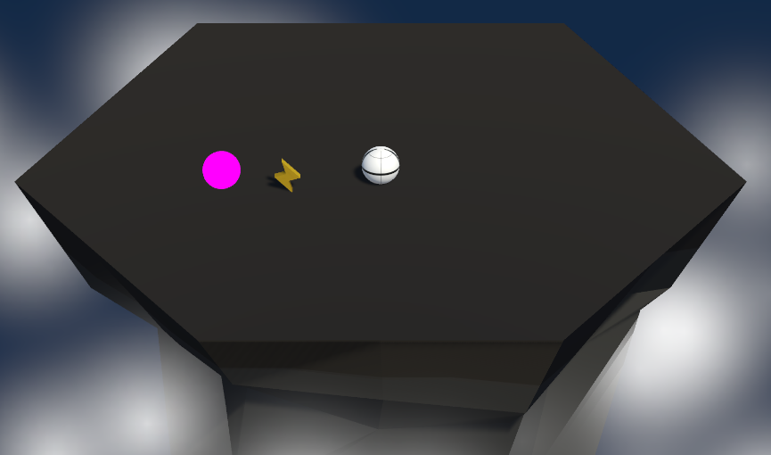
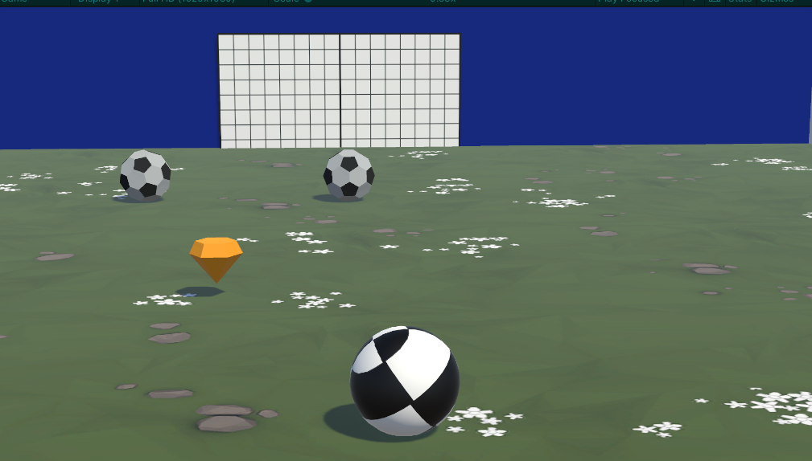

# RollGuard Game Project & RollSoccer Game Project(The RollSoccer Game project is a challenge project, which means it's not the focus of this project)

## RollGuard

RollGuard is a game where the player controls a sphere character, rolling around a platform, trying to stay alive by pushing enemy spheres off the platform. The goal is to survive as long as possible, and with each successful survival, the number of opponent spheres increases.

### Game Mechanics:
- **Sphere Control:** The player navigates the sphere using the WASD keys.
1- W,S: Moves the Player forward and backward
2- A,D: Rotates the Camera
- **Rolling Ability:** The player's sphere moves by rolling, avoiding enemy spheres to stay on the platform.

### Game Objects:
- **Enemy Spheres:** Spheres that try to collide with the player to push them off the platform.
- **Special Power Objects:** Objects that, when collected, provide a powerful force to push enemy spheres away.

### Core Objective:
- The player must stay alive by pushing enemy spheres off the platform before falling off themselves.
- The number of opponent spheres increases with each survival round.

### Progression System:
- The surviving player faces an increasing number of opponent spheres each round, elevating the difficulty.
- Players earn points for each enemy sphere pushed off the platform.
- Total points determine the player's overall score.

### Special Powers:
- **Special Power Objects:** When collected, enemy spheres thrown off by colliding with the player travel long distances, ensuring they fall off the platform.

### Additional Features:
- Varied difficulty levels.
- Strategic use of special power objects, adding depth to the gameplay.

### Screenshot

## RollSoccer

RollSoccer is a soccer-inspired game where the player controls a sphere character on a soccer field. The objective is to score goals by maneuvering opponents (soccer ball-like spheres) into their own goals. With each successful round, the number of opponent spheres increases, providing an escalating challenge.

### Game Mechanics:
- **Sphere Control:** The player navigates the sphere character using the WASD keys.
1- W,S: Moves the Player forward and backward
2- A,D: Rotates the Camera
- **Scoring Goals:** The player scores goals by pushing opponent spheres into their goal.

### Game Objects:
- **Opponent Spheres (Soccer Balls):** These spheres aim to enter the player's goal to score points.
- **Special Power Objects:** Objects that grant the player extra push power for a better strategic play.

### Core Objective:
- The player must score as many goals as possible by directing opponent spheres into their own goals without letting them score.

### Round System:
- After each successful round (goal scored), a new opponent sphere is added to the field, increasing the challenge.

### Progression System:
- The game's difficulty rises with each round, as the number of opponent spheres increases.
- Players earn points for each goal scored, contributing to their overall score.

### Special Powers:
- **Special Power Objects:** Collected to gain extra push power.

### Scoring System:
- Players accumulate points for each goal scored.
- The total points determine the player's standing in the game.

### Screenshot

